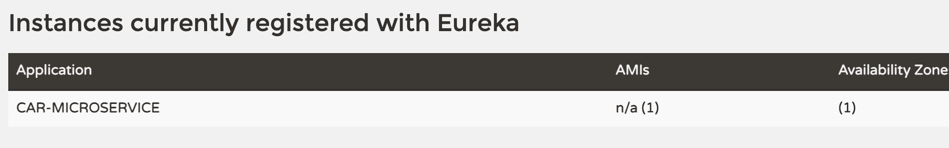
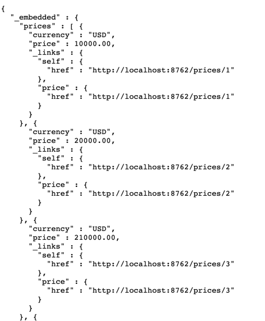

# Pricing Service

The Pricing Service is a REST WebService that simulates a backend that
would store and retrieve the price of a vehicle given a vehicle id as
input. In this project, you will convert it to a microservice.

### pricing
PricingServiceApplication
This launches the Pricing Service as a Spring Boot application.

### pricing.api
PricingController
This is our actual REST controller for the application. This implements what a GET request will respond with - in this case, a randomly generated price gathered from the PricingService. 
Once converted to a microservice, the Controller should not be explicitly necessary.
> why not be necessary after change to microservice?  
> see [how does Spring Data Rest work?](#sdr)  
> But we need this controller to do code controller test, so don't delete it

### pricing.domain.price
Price
This declares the Price class, primarily just made of the private variables currency, price and vehicleId.

### PriceRepository
This repository provide a type of data persistence while the web service runs, namely the ID->price pairing generated by the PricingService.

### pricing.service
PriceException
This creates a PriceException that can be thrown when an issue arises in the PricingService.

### PricingService
The Pricing Service does most of the legwork of the code. 
Here, it creates a mapping of random prices to IDs, as well as the method (in our mock service here) 
to generate the random prices. 
Once converted to a microservice, the Service should not be explicitly necessary.

## Features

- REST WebService integrated with Spring Boot

#TODOs
## 1. Convert the Pricing Service to be a microservice.
### Eureka server：
1. Add dependencies: Config Client and Eureka Server on spring initializr
2. set application.properties:
  - set application name
  - set default port 8761
  - indicate that this is a server rather than client
  - set log level to see additional info
    - now use: {TRACE, DEBUG, INFO, WARN, ERROR, FATAL, OFF} instead of ON as the value
3. EurekaApplication add annotation to notify that is a eureka server
4. http://localhost:8761/ to see eureka page
### Eureka Client： pricing-service
1. [pom.xml](./pom.xml): add eureka client and spring cloud dependencies.
2. [price.java](./src/main/java/com/udacity/pricing/domain/price/Price.java): make it @Entity and add auto increased Id as primary key. 
3. [PriceRepository.java](./src/main/java/com/udacity/pricing/domain/price/PriceRepository.java): change PriceRepository to interface and use Spring data rest (extends CrudRepository).
4. Use a web browser to view the Eureka web console to ensure your microservice is registered.

5. access rest api created by spring data rest: http://localhost:8082/prices
    > see [how does Spring Data Rest work?](#sdr)  
    
    
### <span id="sdr">how does Spring Data Rest work?</span>
1. At application startup, Spring Data Rest finds all of the **spring data repositories**
2. Then, Spring Data Rest **creates an endpoint** that matches the entity name
3. Next, Spring Data Rest **appends an S** to the entity name in the endpoint
4. Lastly, Spring Data Rest exposes CRUD (Create, Read, Update, and Delete) operations as RESTful APIs over HTTP


## 2. Add an additional test 
> add test to check whether the application appropriately generates a price for a given vehicle ID

- [PricingControllerUnitTest](./src/test/java/com/udacity/pricing/web/PricingControllerUnitTest.java): 
    - RunWith, WebMvcTest
    ```java
    MockMvcRequestBuilders.get("/services/price")).param("vehicleId", "1")
    ```

# execute:
http://localhost:8761/ to see eureka page
access rest api created by spring data rest: http://localhost:8082/prices
# Question:
## difference between CrudRepository and @Repository?
- @Repository:
    - The inclusion of this annotation is necessary since it will allow the DogRepository to be included in the Application Context/Spring Container and thus be used throughout the application.
- CrudRepository:
    - the CrudRepository interface already provides us with methods that perform CRUD operations and that we can use them as they are:
        1. save
        2. findById
        3. findAll
           4.saveAll
        5. delete
        6. deleteById
        7. deleteAll
    -  we have to follow this structure because it is the way Spring Data gives us to perform CRUD operations, which is similar to the structure MyBatis gives us to perform CRUD operations.

## eureka.instance.prefer-ip-address=true?
Set eureka.instance.preferIpAddress to true and, when the application registers with eureka, it uses its IP address rather than its hostname.